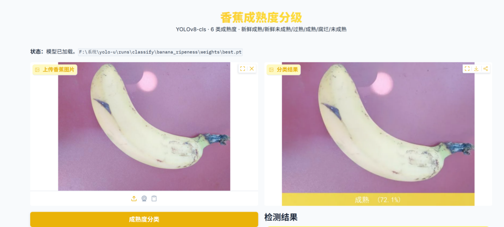
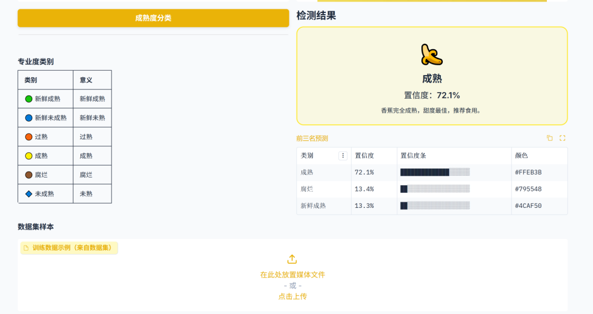

# Banana Ripeness Classification

基于 YOLOv8-cls 的香蕉成熟度分类项目，支持 **6 类成熟度**识别，并提供 Gradio Web 界面。

## 项目结构

```
yolo-u/
├── Banana Ripeness Classification.v1-original-images.folder.zip   # 数据集压缩包
├── train_banana.py                                                 # 训练脚本
├── app.py                                                          # Gradio Web 推理界面
├── demo_predict.py                                                 # 简易预测示例
├── yolov8n-cls.pt                                                  # YOLOv8 分类预训练权重
└── runs/classify/banana_ripeness/weights/
    ├── best.pt                                                     # 训练最佳模型
    └── last.pt                                                     # 最近一次模型
```

## 类别说明

| 类别 | 中文含义 | 说明 |
|------|---------|------|
| freshripe | 新鲜成熟 | 香蕉已成熟，色泽鲜黄，适合立即食用 |
| freshunripe | 新鲜未熟 | 新鲜但未成熟，建议放置 2-4 天 |
| overripe | 过熟 | 表皮出现褐斑，需尽快食用或加工 |
| ripe | 成熟 | 完全成熟，甜度最佳 |
| rotten | 腐烂 | 已腐烂变质，不可食用 |
| unripe | 未熟 | 颜色青绿，需等待成熟 |

## 环境要求

- Python 3.8+
- CUDA（可选，训练加速）

```bash
pip install ultralytics gradio pillow numpy
```

## 1. 准备数据集

将项目根目录的 `Banana Ripeness Classification.v1-original-images.folder.zip` 解压到 `ultralytics/datasets/` 下，目录结构如下：

```
ultralytics/datasets/Banana Ripeness Classification.v1-original-images.folder/
├── train/
│   ├── freshripe/
│   ├── freshunripe/
│   ├── overripe/
│   ├── ripe/
│   ├── rotten/
│   └── unripe/
├── test/
│   └── ...（同上 6 个类别）
└── valid/
    └── ...（同上 6 个类别）
```

项目已有另一个 zip 副本位于 `ultralytics/datasets/` 下，直接解压即可。

## 2. 训练

运行 `train_banana.py`：

```bash
python train_banana.py
```

主要训练参数（可在脚本中修改）：

| 参数 | 默认值 | 说明 |
|------|--------|------|
| `data` | `ultralytics/datasets/Banana...folder/` | 数据集路径 |
| `epochs` | 100 | 训练轮数 |
| `imgsz` | 640 | 输入图像尺寸 |
| `batch` | 16 | 批次大小 |
| `device` | `cuda` | 训练设备（CPU 改为 `cpu`） |
| `patience` | 15 | 早停轮数 |
| `augment` | True | 是否启用数据增强 |

训练完成后，模型保存在 `runs/classify/banana_ripeness/weights/` 目录下。



## 3. 运行 Web 界面

```bash
python app.py
```

可选参数：

```bash
python app.py --port 7860 --server_name 127.0.0.1   # 自定义端口和地址
python app.py --share                                 # 创建公网分享链接
```

启动后在浏览器打开 `http://localhost:7861`，上传香蕉图片即可得到分类结果和 Top-3 预测。



## 模型路径配置

| 脚本 | 配置位置 | 说明 |
|------|---------|------|
| `app.py:25-26` | `MODEL_PATH` | Web 界面加载的模型，默认为 `runs/classify/banana_ripeness/weights/best.pt` |
| `train_banana.py:22` | `YOLO('yolov8n-cls.pt')` | 训练时加载的预训练权重 |

两个路径都是基于 `__file__` 计算的 **绝对路径**，无需从特定目录启动。
